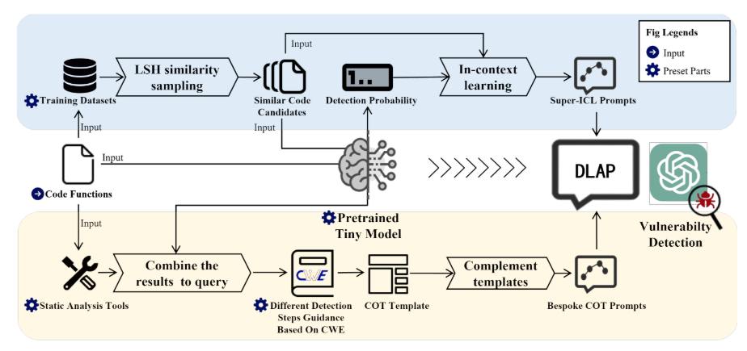

# DLAP: A Deep Learning Augmented Large Language Model Prompting Framework for Software Vulnerability Detection

## Introduction

The overall framework is divided into 2 parts:


### SuperICL Parts (Top)

***SupICL.py***: - Construction of in-context learning prompts augmented by DL models 

### Bespoke COT Parts (Bottom)

***ChainofThought.py***: - Generation of the bespoke COT prompts to augment LLMs.

### Other Parts (Process Automatically)

***mainDect.py*** (the main program to call and process automatically)

|- codesensor: Static Processing Tool

|- data: Dataset

|- LLMmodel: Large Language Model Invocation

|- result: Result Storage

|- tmp: Process Redundancy

|- tools: Utility Classes

|- config: Configuration

**Besides**, The *Beacon.py* and *COTTree.py* are for ***ChainofThought.py***

The *Generpromp.py* is for ***SupICL.py***


## How to Run the DLAP
### Environment Configuration

#### 1.System Environment Variables
You need to watch file LLMmodel/GPT.py to set your key
Here are the system environment variables that need to be configured when using GPT. If using other large language models, please configure them according to the respective requirements. GPT is used as an example as follows.

##### 2.Configure HTTP & HTTPS Proxy Port

You need to configure the HTTP & HTTPS proxy ports for accessing GPT via network requests. You should add two key-value pairs to your system environment variables, namely HTTP_PROXY and HTTPS_PROXY, with the corresponding values being the network proxy port you want to use (e.g., if using Clash as the proxy port, set it to 7890).

##### 3.Configure OpenAI KEY

Accessing GPT requires an OpenAI KEY. You need to add a key-value pair to your system environment variables, with the key being "openaikey" and the value being your OpenAI account key. If using premium large models like GPT-4, running the code will incur corresponding charges.

#### 4. Configuration File

The configuration file is placed in the `config` folder, and the specific contents are explained as follows:

##### `LLM_Func` 

- `LLM_model`: Set the large language model you want to use, typically "GPT"
- `Action4code`
  - `data_set`: Set the dataset, you can choose from "linux_kernel" "debian" "FFmpeg" "LibTIFF" "LibPNG"
  - `data_size`: Set the size of the dataset, change as needed.
  - `seed`: Random seed, change as needed.
- `Beacon`
  - `dlnetwork`: Set the DL model of
   DLAP.
- `Chain`
  - `algorithm`: Set the COT algorithm, typically "detail"
- `Discern`
  - `algorithm`: Set the Discern algorithm, typically "deepsec" 
  - `ICLnum`: The number of ICL entries to include

### Data Preparation and Preprocessing

Before running the process, you need to train your enhanced small model so that it can obtain the prediction confidence for each sample.
In DLAP, we need to prepare the data as follows

1.**Training Set-which is in data/[project name]/train.json(you can carefully replace your project data)**: This is the training set used to form the small model, which will later participate in the SuperICL computation. By reading the our paper, you will understand that we need to identify similar segments within the training set to construct SuperICL prompts. The data format is as follows, and the training set should consist of a large number of these JSON entries:

  ```json
  {
      "code": "static inline int virtio_scsi_get_lun(uint8_t *lun)\n{\n    return ((lun[2] << 8) | lun[3]) & 0x3FFF;\n}\n",
      "label": "0",
      "addr": "https://git.qemu.org/?p=qemu.git;a=commitdiff;h=3c3ce981423e0d6c18af82ee62f1850c2cda5976",
      "vul_func_with_fix": "static inline int virtio_scsi_get_lun(uint8_t *lun)\n{\n    return ((lun[2] << 8) | lun[3]) & 0x3FFF;\n}\n",
      "linevul": 5.232506737229414e-05,
      "sysevr": 0.46735483407974243,
      "devign": 5.2443512686295435e-05
  }
  ```

  In this structure:
  - **code**: This is the source code object that participates in training.
  - **label**: This indicates whether it is a vulnerability label.
  - **addr**: This does not participate in training but can help you verify whether your results align with the expected real entries.
  - **vul_func_with_fix**: This does not participate in training and is intended for the author's future research on automated fixes.
  - **linevul**, **sysevr**, and **devign**: These are integrated from three pre-trained DL models. Since the construction of SuperICL requires using the DL model’s confidence predictions for the current segment, the confidence values are stored directly here.

2.**Test Set-which is in data/[project name]/Gtest.json(you can carefully replace your project data)**: This is the test set used for evaluating the model's performance. In the test set, labels are used for assessment rather than participating directly in training. The data format is as follows:

```json
{
    "code": "static inline int virtio_scsi_get_lun(uint8_t *lun)\n{\n    return ((lun[2] << 8) | lun[3]) & 0x3FFF;\n}\n",
    "label": "0",
    "addr": "https://git.qemu.org/?p=qemu.git;a=commitdiff;h=3c3ce981423e0d6c18af82ee62f1850c2cda5976",
    "vul_func_with_fix": "static inline int virtio_scsi_get_lun(uint8_t *lun)\n{\n    return ((lun[2] << 8) | lun[3]) & 0x3FFF;\n}\n",
    "linevul": 5.232506737229414e-05,
    "sysevr": 0.46735483407974243,
    "devign": 5.2443512686295435e-05
}
```

In this structure:

- **code**: This is the source code snippet used for testing. The model will make predictions based on these code snippets.
- **label**: This indicates whether the code snippet is considered vulnerable (e.g., "1" for vulnerable and "0" for non-vulnerable). It is used to evaluate the model's performance, not to train it.
- **addr**: The URL or address of the source where the code snippet originates. This is useful for verification and reference but not used directly in the model's prediction process.
- **vul_func_with_fix**: A version of the code snippet with a fix applied. This is not used in testing but may be useful for future research into automated code fixing.
- **linevul**, **sysevr**, and **devign**: Confidence scores from three different pre-trained deep learning models. These scores provide additional context for analyzing the model's performance on the test set.

The purpose of the test set is to evaluate the model's accuracy and effectiveness by comparing its predictions against the actual labels.


## Running the Code

After modifying the configuration file and data preparation, you need to change the configuration file you need in mainDect.py, specifically:

```
config_file = "config.yaml"
```

Then, you can run mainDect, 
```python
python mainDect.py
```

and you will find the corresponding log files in the `result` folder.

The current `result` contains the outcomes of the three research questions (RQs) from this paper. You can replace them with the results from your own project to obtain your detection results!
To evaluate the relationship between the predicted values and the actual labels in your `result` logs, you can use `sklearn`'s `classification_report` to generate a detailed evaluation report. Here's how you can do it:

1. **Ensure Data Preparation**: First, make sure you have two lists: one for the true labels and one for the predicted labels.

2. **Use `classification_report`**: You can use the following Python code to generate the evaluation report:

```python
from sklearn.metrics import classification_report

# Example lists for true labels and predicted labels
true_labels = [Your data label or read the our log label]  # Replace with your true labels
predicted_labels = [Your data prediction or read the our prediction]  # Replace with your predicted labels

# Generate the classification report
report = classification_report(true_labels, predicted_labels, target_names=['Non-Vulnerable', 'Vulnerable'])

# Print the report
print(report)
```

3. **Explanation of Metrics**:
   - **Precision**: The ratio of correctly predicted positive observations to the total predicted positives.
   - **Recall (Sensitivity)**: The ratio of correctly predicted positive observations to the all observations in actual class.
   - **F1-Score**: The weighted average of Precision and Recall. It considers both false positives and false negatives.
   - **Support**: The number of actual occurrences of the class in the specified dataset.

Replace the example lists with your actual data to get your evaluation results. This will give you a comprehensive understanding of your model's performance in terms of precision, recall, and F1-score for each class. Additionally, we have provided example analysis code for each RQ result

```python
 python ./result/RQ2/DLAP/result.py
```
 which you can use as a model for your evaluation analysis.

 # The result in Paper
We have structured our results around three research questions (RQs) focusing on different comparisons. Here's a brief summary of each:

-**RQ1**: This involves comparing the performance of the three deep learning (DL) models that you have currently trained. You can analyze which model performs best based on your chosen metrics.

-**RQ2**: This focuses on comparing the results from your paper against four baseline models. This analysis will help determine how your models stack up against established benchmarks.

-**RQ3**: This compares your models with the results obtained using LoRA (Low-Rank Adaptation) fine-tuning techniques. This will help assess the impact and effectiveness of LoRA fine-tuning in your specific context.

For each RQ, you can use the example analysis code provided to conduct a detailed evaluation. This will allow you to understand the strengths and weaknesses of each approach and draw meaningful conclusions from your research.
